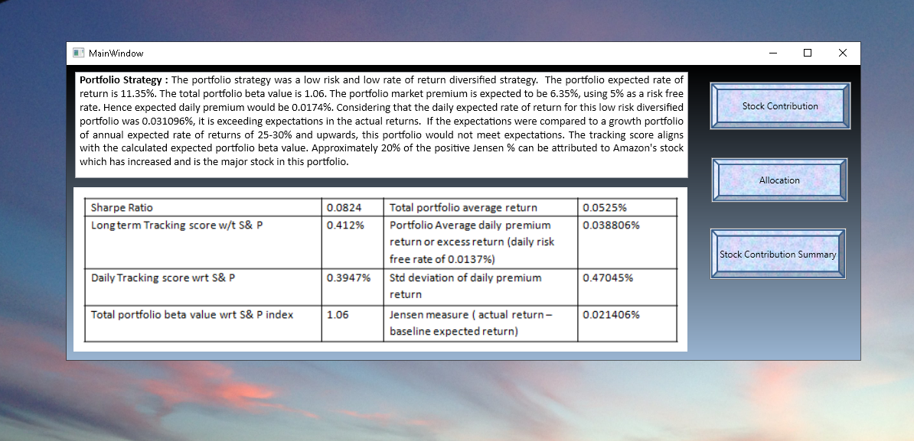
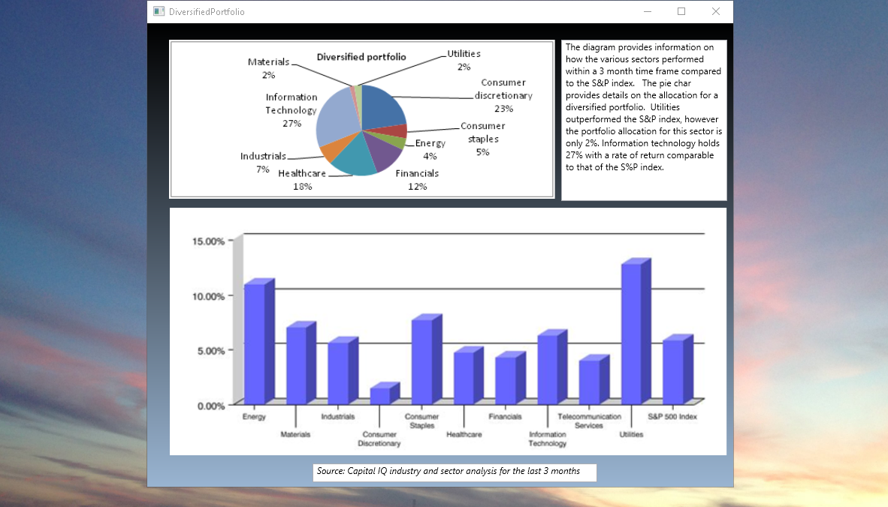
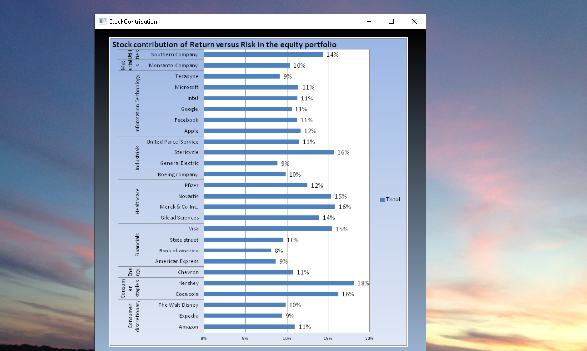
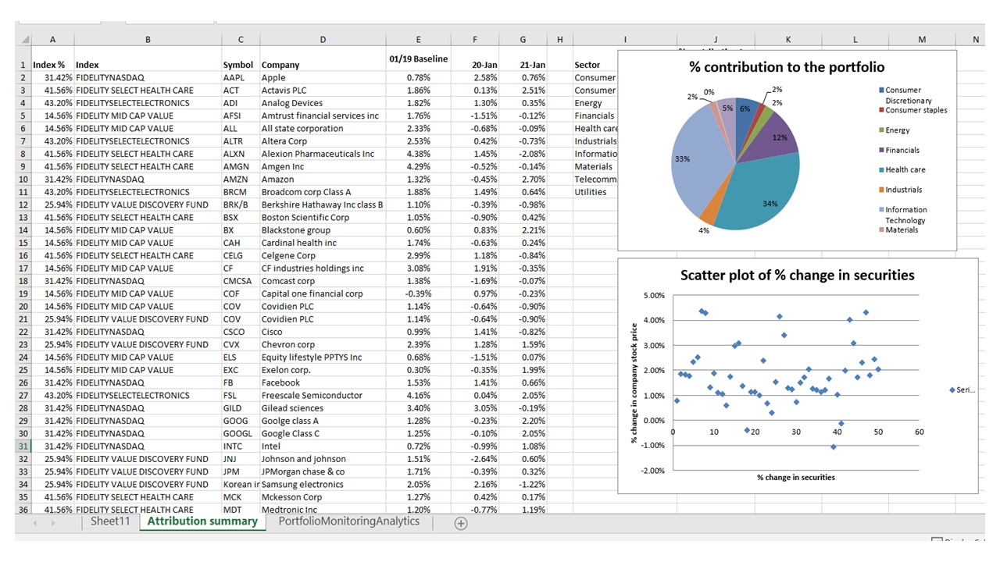
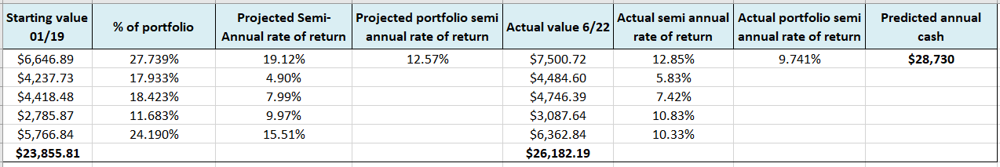
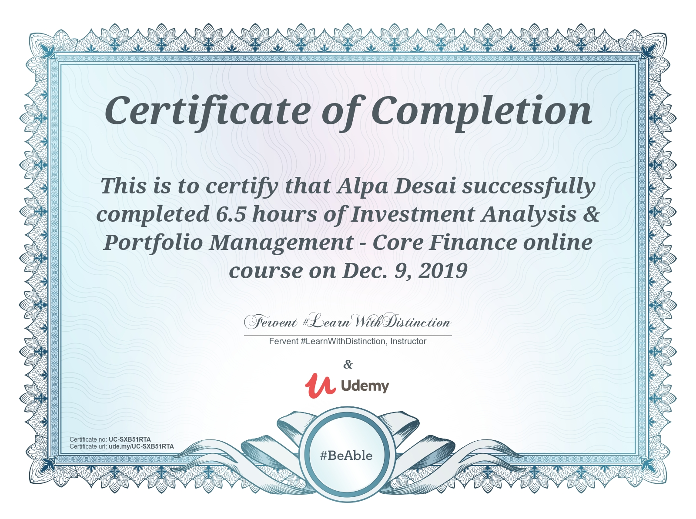

# Investment Portfolio

The project provides an introduction to a custom portfolio strategy. Confidential information is not displayed. 
Please download the executable in https://github.com/alpaddesai/Equities-Project/releases for details.
All images are either custom by Alpa D Desai or a reference name is included. 
Most of the images are custom. 

## Portfolio Strategy 

## Diversified Portfolio Allocation

## Stock Contribution Rate of Return 

## Equity Contribution of Risk versus Return 

## Investment Portfolio

## Investment Management and Portfolio Certification

## exam

## Ethics and Integrity

Additional details : https://github.com/alpaddesai/PortfolioReturnGUIIdea
